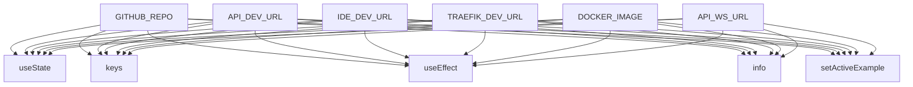

# System Architecture Analysis

## Overview

- **Project**: /home/tom/github/oqlos/www
- **Primary Language**: javascript
- **Languages**: javascript: 31, shell: 3
- **Analysis Mode**: static
- **Total Functions**: 93
- **Total Classes**: 1
- **Modules**: 34
- **Entry Points**: 87

## Architecture by Module

### src.pages.Landing
- **Functions**: 15
- **File**: `Landing.jsx`

### src.i18n.I18nProvider
- **Functions**: 13
- **File**: `I18nProvider.jsx`

### src.pages.Login
- **Functions**: 11
- **File**: `Login.jsx`

### src.components.CodeEditor
- **Functions**: 8
- **File**: `CodeEditor.jsx`

### src.hooks.useAuth
- **Functions**: 6
- **File**: `useAuth.js`

### src.mocks.api
- **Functions**: 6
- **File**: `api.js`

### e2e.demo-user.spec
- **Functions**: 6
- **File**: `demo-user.spec.js`

### e2e.landing.spec
- **Functions**: 5
- **File**: `landing.spec.js`

### src.components.TerminalSim
- **Functions**: 4
- **File**: `TerminalSim.jsx`

### src.components.ErrorBoundary
- **Functions**: 4
- **Classes**: 1
- **File**: `ErrorBoundary.jsx`

### src.pages.NlpConsole
- **Functions**: 4
- **File**: `NlpConsole.jsx`

### src.utils.logger.spec
- **Functions**: 4
- **File**: `logger.spec.js`

### src.utils.logger
- **Functions**: 4
- **File**: `logger.js`

### src.pages.Billing
- **Functions**: 3
- **File**: `Billing.jsx`

### e2e.smoke.spec
- **Functions**: 3
- **File**: `smoke.spec.js`

### src.data.install-commands
- **Functions**: 2
- **File**: `install-commands.js`

### src.components.ProtectedRoute
- **Functions**: 1
- **File**: `ProtectedRoute.jsx`

### src.pages.Scenarios
- **Functions**: 1
- **File**: `Scenarios.jsx`

## Key Entry Points

Main execution flows into the system:

### src.pages.Landing.GITHUB_REPO
- **Calls**: src.pages.Landing.useState, src.pages.Landing.keys, src.pages.Landing.useEffect, src.pages.Landing.info, src.pages.Landing.setActiveExample, src.pages.Landing.debug, src.pages.Landing.setActiveTab, src.pages.Landing.writeText

### src.pages.Landing.API_DEV_URL
- **Calls**: src.pages.Landing.useState, src.pages.Landing.keys, src.pages.Landing.useEffect, src.pages.Landing.info, src.pages.Landing.setActiveExample, src.pages.Landing.debug, src.pages.Landing.setActiveTab, src.pages.Landing.writeText

### src.pages.Landing.IDE_DEV_URL
- **Calls**: src.pages.Landing.useState, src.pages.Landing.keys, src.pages.Landing.useEffect, src.pages.Landing.info, src.pages.Landing.setActiveExample, src.pages.Landing.debug, src.pages.Landing.setActiveTab, src.pages.Landing.writeText

### src.pages.Landing.TRAEFIK_DEV_URL
- **Calls**: src.pages.Landing.useState, src.pages.Landing.keys, src.pages.Landing.useEffect, src.pages.Landing.info, src.pages.Landing.setActiveExample, src.pages.Landing.debug, src.pages.Landing.setActiveTab, src.pages.Landing.writeText

### src.pages.Landing.DOCKER_IMAGE
- **Calls**: src.pages.Landing.useState, src.pages.Landing.keys, src.pages.Landing.useEffect, src.pages.Landing.info, src.pages.Landing.setActiveExample, src.pages.Landing.debug, src.pages.Landing.setActiveTab, src.pages.Landing.writeText

### src.pages.Landing.API_WS_URL
- **Calls**: src.pages.Landing.useState, src.pages.Landing.keys, src.pages.Landing.useEffect, src.pages.Landing.info, src.pages.Landing.setActiveExample, src.pages.Landing.debug, src.pages.Landing.setActiveTab, src.pages.Landing.writeText

### src.pages.Landing.HARDWARE_MODE
- **Calls**: src.pages.Landing.useState, src.pages.Landing.keys, src.pages.Landing.useEffect, src.pages.Landing.info, src.pages.Landing.setActiveExample, src.pages.Landing.debug, src.pages.Landing.setActiveTab, src.pages.Landing.writeText

### src.pages.Landing.MODBUS_SERIAL_PORT
- **Calls**: src.pages.Landing.useState, src.pages.Landing.keys, src.pages.Landing.useEffect, src.pages.Landing.info, src.pages.Landing.setActiveExample, src.pages.Landing.debug, src.pages.Landing.setActiveTab, src.pages.Landing.writeText

### src.pages.Landing.I2C_BUS
- **Calls**: src.pages.Landing.useState, src.pages.Landing.keys, src.pages.Landing.useEffect, src.pages.Landing.info, src.pages.Landing.setActiveExample, src.pages.Landing.debug, src.pages.Landing.setActiveTab, src.pages.Landing.writeText

### src.pages.Landing.USB_DEVICE
- **Calls**: src.pages.Landing.useState, src.pages.Landing.keys, src.pages.Landing.useEffect, src.pages.Landing.info, src.pages.Landing.setActiveExample, src.pages.Landing.debug, src.pages.Landing.setActiveTab, src.pages.Landing.writeText

### src.pages.Landing.OQLAGENT_PORT
- **Calls**: src.pages.Landing.useState, src.pages.Landing.keys, src.pages.Landing.useEffect, src.pages.Landing.info, src.pages.Landing.setActiveExample, src.pages.Landing.debug, src.pages.Landing.setActiveTab, src.pages.Landing.writeText

### src.pages.Login.handleSubmit
- **Calls**: src.pages.Login.preventDefault, src.pages.Login.setLoading, src.pages.Login.setMsg, src.pages.Login.log, src.pages.Login.mockFetch, src.pages.Login.stringify, src.pages.Login.json, src.pages.Login.setItem

### src.pages.Login.token
- **Calls**: src.pages.Login.useEffect, src.pages.Login.setLoading, src.pages.Login.mockFetch, src.pages.Login.json, src.pages.Login.setItem, src.pages.Login.stringify, src.pages.Login.setMsg, src.pages.Login.t

### src.pages.Login.plan
- **Calls**: src.pages.Login.useEffect, src.pages.Login.setLoading, src.pages.Login.mockFetch, src.pages.Login.json, src.pages.Login.setItem, src.pages.Login.stringify, src.pages.Login.setMsg, src.pages.Login.t

### src.pages.Login.verifyTokenRef
- **Calls**: src.pages.Login.useEffect, src.pages.Login.setLoading, src.pages.Login.mockFetch, src.pages.Login.json, src.pages.Login.setItem, src.pages.Login.stringify, src.pages.Login.setMsg, src.pages.Login.t

### src.pages.Login.autoSubmitRef
- **Calls**: src.pages.Login.useEffect, src.pages.Login.setLoading, src.pages.Login.mockFetch, src.pages.Login.json, src.pages.Login.setItem, src.pages.Login.stringify, src.pages.Login.setMsg, src.pages.Login.t

### src.pages.NlpConsole.handleSubmit
- **Calls**: src.pages.NlpConsole.preventDefault, src.pages.NlpConsole.trim, src.pages.NlpConsole.setLoading, src.pages.NlpConsole.setOutput, src.pages.NlpConsole.mockFetch, src.pages.NlpConsole.stringify, src.pages.NlpConsole.json, src.pages.NlpConsole.join

### e2e.demo-user.spec.mockBackendRoutes
- **Calls**: e2e.demo-user.spec.route, e2e.demo-user.spec.request, e2e.demo-user.spec.parse, e2e.demo-user.spec.postData, e2e.demo-user.spec.fulfill, e2e.demo-user.spec.stringify, e2e.demo-user.spec.Date, e2e.demo-user.spec.toISOString

### src.pages.Login.data
- **Calls**: src.pages.Login.setItem, src.pages.Login.stringify, src.pages.Login.setMsg, src.pages.Login.t, src.pages.Login.setTimeout, src.pages.Login.navigate, src.pages.Login.setEmail

### src.hooks.useAuth.useAuth
- **Calls**: src.hooks.useAuth.useNavigate, src.hooks.useAuth.getItem, src.hooks.useAuth.parse, src.hooks.useAuth.Boolean, src.hooks.useAuth.removeItem, src.hooks.useAuth.navigate

### src.components.CodeEditor.highlightOQL
- **Calls**: src.components.CodeEditor.split, src.components.CodeEditor.map, src.components.CodeEditor.replace, src.components.CodeEditor.b, src.components.CodeEditor.String, src.components.CodeEditor.padStart

### src.components.CodeEditor.highlightIQL
- **Calls**: src.components.CodeEditor.split, src.components.CodeEditor.map, src.components.CodeEditor.replace, src.components.CodeEditor.b, src.components.CodeEditor.String, src.components.CodeEditor.padStart

### src.i18n.I18nProvider.I18nProvider
- **Calls**: src.i18n.I18nProvider.useState, src.i18n.I18nProvider.useCallback, src.i18n.I18nProvider.setLangState, src.i18n.I18nProvider.setItem, src.i18n.I18nProvider.split, src.i18n.I18nProvider.replace

### src.mocks.api.mockFetch
- **Calls**: src.mocks.api.fetch, src.mocks.api.includes, src.mocks.api.parse, src.mocks.api.log, src.mocks.api.fakeResponse

### src.components.TerminalSim.runSim
- **Calls**: src.components.TerminalSim.setRunning, src.components.TerminalSim.setLines, src.components.TerminalSim.setInterval, src.components.TerminalSim.clearInterval

### src.components.TerminalSim.idx
- **Calls**: src.components.TerminalSim.setInterval, src.components.TerminalSim.setLines, src.components.TerminalSim.clearInterval, src.components.TerminalSim.setRunning

### src.components.TerminalSim.iv
- **Calls**: src.components.TerminalSim.setInterval, src.components.TerminalSim.setLines, src.components.TerminalSim.clearInterval, src.components.TerminalSim.setRunning

### src.pages.Billing.handleSubscribe
- **Calls**: src.pages.Billing.navigate, src.pages.Billing.mockFetch, src.pages.Billing.json, src.pages.Billing.alert

### src.utils.logger.LOG_LEVEL
- **Calls**: src.utils.logger.push, src.utils.logger.Date, src.utils.logger.toISOString, src.utils.logger.shift

### src.utils.logger.MAX_BUFFER
- **Calls**: src.utils.logger.push, src.utils.logger.Date, src.utils.logger.toISOString, src.utils.logger.shift

## Process Flows

Key execution flows identified:

### Flow 1: GITHUB_REPO
```
GITHUB_REPO [src.pages.Landing]
```

### Flow 2: API_DEV_URL
```
API_DEV_URL [src.pages.Landing]
```

### Flow 3: IDE_DEV_URL
```
IDE_DEV_URL [src.pages.Landing]
```

### Flow 4: TRAEFIK_DEV_URL
```
TRAEFIK_DEV_URL [src.pages.Landing]
```

### Flow 5: DOCKER_IMAGE
```
DOCKER_IMAGE [src.pages.Landing]
```

### Flow 6: API_WS_URL
```
API_WS_URL [src.pages.Landing]
```

### Flow 7: HARDWARE_MODE
```
HARDWARE_MODE [src.pages.Landing]
```

### Flow 8: MODBUS_SERIAL_PORT
```
MODBUS_SERIAL_PORT [src.pages.Landing]
```

### Flow 9: I2C_BUS
```
I2C_BUS [src.pages.Landing]
```

### Flow 10: USB_DEVICE
```
USB_DEVICE [src.pages.Landing]
```

## Key Classes

### src.components.ErrorBoundary.ErrorBoundary
- **Methods**: 4
- **Key Methods**: src.components.ErrorBoundary.ErrorBoundary.super, src.components.ErrorBoundary.ErrorBoundary.getDerivedStateFromError, src.components.ErrorBoundary.ErrorBoundary.componentDidCatch, src.components.ErrorBoundary.ErrorBoundary.render

## Data Transformation Functions

Key functions that process and transform data:

## Public API Surface

Functions exposed as public API (no underscore prefix):

- `src.pages.Landing.GITHUB_REPO` - 26 calls
- `src.pages.Landing.API_DEV_URL` - 26 calls
- `src.pages.Landing.IDE_DEV_URL` - 26 calls
- `src.pages.Landing.TRAEFIK_DEV_URL` - 26 calls
- `src.pages.Landing.DOCKER_IMAGE` - 26 calls
- `src.pages.Landing.API_WS_URL` - 26 calls
- `src.pages.Landing.HARDWARE_MODE` - 26 calls
- `src.pages.Landing.MODBUS_SERIAL_PORT` - 26 calls
- `src.pages.Landing.I2C_BUS` - 26 calls
- `src.pages.Landing.USB_DEVICE` - 26 calls
- `src.pages.Landing.OQLAGENT_PORT` - 26 calls
- `src.pages.Login.handleSubmit` - 12 calls
- `src.pages.Login.token` - 10 calls
- `src.pages.Login.plan` - 10 calls
- `src.pages.Login.verifyTokenRef` - 10 calls
- `src.pages.Login.autoSubmitRef` - 10 calls
- `src.pages.Login.navigate` - 9 calls
- `src.pages.NlpConsole.handleSubmit` - 8 calls
- `e2e.demo-user.spec.mockBackendRoutes` - 8 calls
- `src.pages.Login.data` - 7 calls
- `src.hooks.useAuth.useAuth` - 6 calls
- `src.components.CodeEditor.highlightOQL` - 6 calls
- `src.components.CodeEditor.highlightIQL` - 6 calls
- `src.i18n.I18nProvider.I18nProvider` - 6 calls
- `src.mocks.api.mockFetch` - 5 calls
- `src.components.TerminalSim.runSim` - 4 calls
- `src.components.TerminalSim.idx` - 4 calls
- `src.components.TerminalSim.iv` - 4 calls
- `src.pages.Billing.handleSubscribe` - 4 calls
- `src.utils.logger.LOG_LEVEL` - 4 calls
- `src.utils.logger.MAX_BUFFER` - 4 calls
- `src.pages.Landing.handleCopy` - 4 calls
- `src.pages.NlpConsole.data` - 3 calls
- `src.i18n.I18nProvider.SUPPORTED_LANGS` - 3 calls
- `src.i18n.I18nProvider.I18nContext` - 3 calls
- `src.i18n.I18nProvider.getInitialLang` - 3 calls
- `src.i18n.I18nProvider.setLang` - 3 calls
- `src.i18n.I18nProvider.dict` - 3 calls
- `src.i18n.I18nProvider.t` - 3 calls
- `src.mocks.api.fakeResponse` - 3 calls

## System Interactions

How components interact:



## Reverse Engineering Guidelines

1. **Entry Points**: Start analysis from the entry points listed above
2. **Core Logic**: Focus on classes with many methods
3. **Data Flow**: Follow data transformation functions
4. **Process Flows**: Use the flow diagrams for execution paths
5. **API Surface**: Public API functions reveal the interface

## Context for LLM

Maintain the identified architectural patterns and public API surface when suggesting changes.