# System Architecture Analysis

## Overview

- **Project**: /home/tom/github/oqlos/www
- **Primary Language**: javascript
- **Languages**: javascript: 18, shell: 2
- **Analysis Mode**: static
- **Total Functions**: 60
- **Total Classes**: 0
- **Modules**: 20
- **Entry Points**: 52

## Architecture by Module

### TODO.oqlos-landing
- **Functions**: 16
- **File**: `oqlos-landing.jsx`

### src.components.CodeEditor
- **Functions**: 8
- **File**: `CodeEditor.jsx`

### src.pages.Login
- **Functions**: 8
- **File**: `Login.jsx`

### src.pages.NlpConsole
- **Functions**: 7
- **File**: `NlpConsole.jsx`

### src.pages.Billing
- **Functions**: 6
- **File**: `Billing.jsx`

### e2e.landing.spec
- **Functions**: 5
- **File**: `landing.spec.js`

### src.components.TerminalSim
- **Functions**: 4
- **File**: `TerminalSim.jsx`

### src.pages.Scenarios
- **Functions**: 4
- **File**: `Scenarios.jsx`

### src.pages.Dashboard
- **Functions**: 4
- **File**: `Dashboard.jsx`

### e2e.smoke.spec
- **Functions**: 3
- **File**: `smoke.spec.js`

### src.pages.Landing
- **Functions**: 1
- **File**: `Landing.jsx`

## Key Entry Points

Main execution flows into the system:

### TODO.oqlos-landing.exampleKeys
- **Calls**: TODO.oqlos-landing.url, TODO.oqlos-landing.var, TODO.oqlos-landing.gradient, TODO.oqlos-landing.rgba, TODO.oqlos-landing.clamp, TODO.oqlos-landing.translateY, TODO.oqlos-landing.repeat, TODO.oqlos-landing.minmax

### TODO.oqlos-landing.TerminalSim
- **Calls**: TODO.oqlos-landing.useState, TODO.oqlos-landing.useRef, TODO.oqlos-landing.run, TODO.oqlos-landing.02s, TODO.oqlos-landing.setRunning, TODO.oqlos-landing.setLines, TODO.oqlos-landing.setInterval, TODO.oqlos-landing.clearInterval

### src.pages.NlpConsole.handleSubmit
- **Calls**: src.pages.NlpConsole.preventDefault, src.pages.NlpConsole.trim, src.pages.NlpConsole.setLoading, src.pages.NlpConsole.setOutput, src.pages.NlpConsole.fetch, src.pages.NlpConsole.stringify, src.pages.NlpConsole.json, src.pages.NlpConsole.join

### src.pages.Login.handleSubmit
- **Calls**: src.pages.Login.preventDefault, src.pages.Login.setLoading, src.pages.Login.setMsg, src.pages.Login.fetch, src.pages.Login.stringify, src.pages.Login.json, src.pages.Login.setEmail

### TODO.oqlos-landing.CodeEditor
- **Calls**: TODO.oqlos-landing.useState, TODO.oqlos-landing.useRef, TODO.oqlos-landing.useEffect, TODO.oqlos-landing.setCode, TODO.oqlos-landing.setHighlighted, TODO.oqlos-landing.fn, TODO.oqlos-landing.join

### src.components.CodeEditor.highlightOQL
- **Calls**: src.components.CodeEditor.split, src.components.CodeEditor.map, src.components.CodeEditor.replace, src.components.CodeEditor.b, src.components.CodeEditor.String, src.components.CodeEditor.padStart

### src.components.CodeEditor.highlightIQL
- **Calls**: src.components.CodeEditor.split, src.components.CodeEditor.map, src.components.CodeEditor.replace, src.components.CodeEditor.b, src.components.CodeEditor.String, src.components.CodeEditor.padStart

### TODO.oqlos-landing.highlightOQL
- **Calls**: TODO.oqlos-landing.split, TODO.oqlos-landing.map, TODO.oqlos-landing.replace, TODO.oqlos-landing.b, TODO.oqlos-landing.String, TODO.oqlos-landing.padStart

### TODO.oqlos-landing.highlightIQL
- **Calls**: TODO.oqlos-landing.split, TODO.oqlos-landing.map, TODO.oqlos-landing.replace, TODO.oqlos-landing.b, TODO.oqlos-landing.String, TODO.oqlos-landing.padStart

### src.components.TerminalSim.runSim
- **Calls**: src.components.TerminalSim.setRunning, src.components.TerminalSim.setLines, src.components.TerminalSim.setInterval, src.components.TerminalSim.clearInterval

### src.components.TerminalSim.idx
- **Calls**: src.components.TerminalSim.setInterval, src.components.TerminalSim.setLines, src.components.TerminalSim.clearInterval, src.components.TerminalSim.setRunning

### src.components.TerminalSim.iv
- **Calls**: src.components.TerminalSim.setInterval, src.components.TerminalSim.setLines, src.components.TerminalSim.clearInterval, src.components.TerminalSim.setRunning

### src.pages.Billing.handleSubscribe
- **Calls**: src.pages.Billing.navigate, src.pages.Billing.fetch, src.pages.Billing.json, src.pages.Billing.alert

### TODO.oqlos-landing.runSim
- **Calls**: TODO.oqlos-landing.setRunning, TODO.oqlos-landing.setLines, TODO.oqlos-landing.setInterval, TODO.oqlos-landing.clearInterval

### TODO.oqlos-landing.idx
- **Calls**: TODO.oqlos-landing.setInterval, TODO.oqlos-landing.setLines, TODO.oqlos-landing.clearInterval, TODO.oqlos-landing.setRunning

### TODO.oqlos-landing.iv
- **Calls**: TODO.oqlos-landing.setInterval, TODO.oqlos-landing.setLines, TODO.oqlos-landing.clearInterval, TODO.oqlos-landing.setRunning

### TODO.oqlos-landing.ArchDiagram
- **Calls**: TODO.oqlos-landing.url, TODO.oqlos-landing.rgba, TODO.oqlos-landing.CLI, TODO.oqlos-landing.oqlagent

### src.pages.NlpConsole.data
- **Calls**: src.pages.NlpConsole.setOutput, src.pages.NlpConsole.join, src.pages.NlpConsole.stringify

### e2e.smoke.spec.response
- **Calls**: e2e.smoke.spec.status, e2e.smoke.spec.expect, e2e.smoke.spec.toContain

### src.components.CodeEditor.textareaRef
- **Calls**: src.components.CodeEditor.useEffect, src.components.CodeEditor.setCode

### src.components.CodeEditor.preRef
- **Calls**: src.components.CodeEditor.useEffect, src.components.CodeEditor.setCode

### src.pages.NlpConsole.user
- **Calls**: src.pages.NlpConsole.parse, src.pages.NlpConsole.getItem

### src.pages.NlpConsole.endpoint
- **Calls**: src.pages.NlpConsole.fetch, src.pages.NlpConsole.stringify

### src.pages.NlpConsole.res
- **Calls**: src.pages.NlpConsole.fetch, src.pages.NlpConsole.stringify

### src.pages.Login.token
- **Calls**: src.pages.Login.useEffect, src.pages.Login.verifyToken

### src.pages.Login.res
- **Calls**: src.pages.Login.fetch, src.pages.Login.stringify

### src.pages.Login.data
- **Calls**: src.pages.Login.setMsg, src.pages.Login.setEmail

### src.pages.Scenarios.user
- **Calls**: src.pages.Scenarios.parse, src.pages.Scenarios.getItem

### src.pages.Billing.user
- **Calls**: src.pages.Billing.parse, src.pages.Billing.getItem

### src.pages.Billing.jwt
- **Calls**: src.pages.Billing.useEffect, src.pages.Billing.setPlan

## Process Flows

Key execution flows identified:

### Flow 1: exampleKeys
```
exampleKeys [TODO.oqlos-landing]
```

### Flow 2: TerminalSim
```
TerminalSim [TODO.oqlos-landing]
```

### Flow 3: handleSubmit
```
handleSubmit [src.pages.NlpConsole]
```

### Flow 4: CodeEditor
```
CodeEditor [TODO.oqlos-landing]
```

### Flow 5: highlightOQL
```
highlightOQL [src.components.CodeEditor]
```

### Flow 6: highlightIQL
```
highlightIQL [src.components.CodeEditor]
```

### Flow 7: runSim
```
runSim [src.components.TerminalSim]
```

### Flow 8: idx
```
idx [src.components.TerminalSim]
```

### Flow 9: iv
```
iv [src.components.TerminalSim]
```

### Flow 10: handleSubscribe
```
handleSubscribe [src.pages.Billing]
  └─> navigate
```

## Data Transformation Functions

Key functions that process and transform data:

## Public API Surface

Functions exposed as public API (no underscore prefix):

- `TODO.oqlos-landing.exampleKeys` - 10 calls
- `TODO.oqlos-landing.TerminalSim` - 9 calls
- `src.pages.NlpConsole.handleSubmit` - 8 calls
- `src.pages.Login.verifyToken` - 8 calls
- `src.pages.Login.handleSubmit` - 7 calls
- `TODO.oqlos-landing.CodeEditor` - 7 calls
- `src.components.CodeEditor.highlightOQL` - 6 calls
- `src.components.CodeEditor.highlightIQL` - 6 calls
- `TODO.oqlos-landing.highlightOQL` - 6 calls
- `TODO.oqlos-landing.highlightIQL` - 6 calls
- `src.components.TerminalSim.runSim` - 4 calls
- `src.components.TerminalSim.idx` - 4 calls
- `src.components.TerminalSim.iv` - 4 calls
- `src.pages.Billing.handleSubscribe` - 4 calls
- `TODO.oqlos-landing.runSim` - 4 calls
- `TODO.oqlos-landing.idx` - 4 calls
- `TODO.oqlos-landing.iv` - 4 calls
- `TODO.oqlos-landing.ArchDiagram` - 4 calls
- `src.pages.NlpConsole.data` - 3 calls
- `e2e.smoke.spec.response` - 3 calls
- `src.components.CodeEditor.textareaRef` - 2 calls
- `src.components.CodeEditor.preRef` - 2 calls
- `src.pages.NlpConsole.navigate` - 2 calls
- `src.pages.NlpConsole.user` - 2 calls
- `src.pages.NlpConsole.endpoint` - 2 calls
- `src.pages.NlpConsole.res` - 2 calls
- `src.pages.Login.navigate` - 2 calls
- `src.pages.Login.token` - 2 calls
- `src.pages.Login.res` - 2 calls
- `src.pages.Login.data` - 2 calls
- `src.pages.Scenarios.navigate` - 2 calls
- `src.pages.Scenarios.user` - 2 calls
- `src.pages.Billing.navigate` - 2 calls
- `src.pages.Billing.user` - 2 calls
- `src.pages.Billing.jwt` - 2 calls
- `src.pages.Dashboard.navigate` - 2 calls
- `src.pages.Dashboard.user` - 2 calls
- `src.pages.Dashboard.logout` - 2 calls
- `TODO.oqlos-landing.textareaRef` - 2 calls
- `TODO.oqlos-landing.preRef` - 2 calls

## System Interactions

How components interact:

```mermaid
graph TD
    exampleKeys --> url
    exampleKeys --> var
    exampleKeys --> gradient
    exampleKeys --> rgba
    exampleKeys --> clamp
    TerminalSim --> useState
    TerminalSim --> useRef
    TerminalSim --> run
    TerminalSim --> 02s
    TerminalSim --> setRunning
    handleSubmit --> preventDefault
    handleSubmit --> trim
    handleSubmit --> setLoading
    handleSubmit --> setOutput
    handleSubmit --> fetch
    handleSubmit --> setMsg
    handleSubmit --> stringify
    CodeEditor --> useState
    CodeEditor --> useRef
    CodeEditor --> useEffect
    CodeEditor --> setCode
    CodeEditor --> setHighlighted
    highlightOQL --> split
    highlightOQL --> map
    highlightOQL --> replace
    highlightOQL --> b
    highlightOQL --> String
    highlightIQL --> split
    highlightIQL --> map
    highlightIQL --> replace
```



## Reverse Engineering Guidelines

1. **Entry Points**: Start analysis from the entry points listed above
2. **Core Logic**: Focus on classes with many methods
3. **Data Flow**: Follow data transformation functions
4. **Process Flows**: Use the flow diagrams for execution paths
5. **API Surface**: Public API functions reveal the interface

## Context for LLM

Maintain the identified architectural patterns and public API surface when suggesting changes.