# System Architecture Analysis

## Overview

- **Project**: /home/tom/github/oqlos/www
- **Primary Language**: javascript
- **Languages**: javascript: 59, shell: 5
- **Analysis Mode**: static
- **Total Functions**: 302
- **Total Classes**: 1
- **Modules**: 64
- **Entry Points**: 284

## Architecture by Module

### src.components.parseOqlToSteps
- **Functions**: 50
- **File**: `parseOqlToSteps.js`

### src.components.TerminalSim
- **Functions**: 26
- **File**: `TerminalSim.jsx`

### src.mocks.api
- **Functions**: 22
- **File**: `api.js`

### src.components.OqlReportRenderer
- **Functions**: 16
- **File**: `OqlReportRenderer.jsx`

### src.components.OqlStepRenderer
- **Functions**: 16
- **File**: `OqlStepRenderer.jsx`

### src.i18n.I18nProvider
- **Functions**: 13
- **File**: `I18nProvider.jsx`

### src.components.CodeEditor
- **Functions**: 11
- **File**: `CodeEditor.jsx`

### src.pages.Login
- **Functions**: 11
- **File**: `Login.jsx`

### src.pages.Billing
- **Functions**: 11
- **File**: `Billing.jsx`

### src.pages.Account
- **Functions**: 10
- **File**: `Account.jsx`

### e2e.scenarios-editor.spec
- **Functions**: 10
- **File**: `scenarios-editor.spec.js`

### e2e.buttons.nlp-buttons.spec
- **Functions**: 10
- **File**: `nlp-buttons.spec.js`

### src.pages.NlpConsole
- **Functions**: 8
- **File**: `NlpConsole.jsx`

### src.pages.Landing
- **Functions**: 8
- **File**: `Landing.jsx`

### src.pages.Scenarios
- **Functions**: 8
- **File**: `Scenarios.jsx`

### e2e.buttons.landing-buttons.spec
- **Functions**: 8
- **File**: `landing-buttons.spec.js`

### src.pages.RoiCalculator
- **Functions**: 7
- **File**: `RoiCalculator.jsx`

### src.hooks.useAuth
- **Functions**: 6
- **File**: `useAuth.js`

### e2e.demo-user.spec
- **Functions**: 6
- **File**: `demo-user.spec.js`

### e2e.billing-payment.spec
- **Functions**: 6
- **File**: `billing-payment.spec.js`

## Key Entry Points

Main execution flows into the system:

### src.pages.Account.handleExportData
- **Calls**: src.pages.Account.Date, src.pages.Account.toISOString, src.pages.Account.Blob, src.pages.Account.stringify, src.pages.Account.createObjectURL, src.pages.Account.createElement, src.pages.Account.split, src.pages.Account.appendChild

### src.components.CodeEditor.highlightOQL
- **Calls**: src.components.CodeEditor.split, src.components.CodeEditor.map, src.components.CodeEditor.replace, src.components.CodeEditor.trimStart, src.components.CodeEditor.startsWith, src.components.CodeEditor.String, src.components.CodeEditor.padStart, src.components.CodeEditor.placeholders

### src.components.CodeEditor.highlightIQL
- **Calls**: src.components.CodeEditor.split, src.components.CodeEditor.map, src.components.CodeEditor.replace, src.components.CodeEditor.trimStart, src.components.CodeEditor.startsWith, src.components.CodeEditor.String, src.components.CodeEditor.padStart, src.components.CodeEditor.push

### src.pages.Login.handleSubmit
- **Calls**: src.pages.Login.preventDefault, src.pages.Login.setLoading, src.pages.Login.setMsg, src.pages.Login.mockFetch, src.pages.Login.stringify, src.pages.Login.json, src.pages.Login.setItem, src.pages.Login.t

### src.pages.Login.token
- **Calls**: src.pages.Login.useEffect, src.pages.Login.setLoading, src.pages.Login.mockFetch, src.pages.Login.json, src.pages.Login.setItem, src.pages.Login.stringify, src.pages.Login.setMsg, src.pages.Login.t

### src.pages.Login.plan
- **Calls**: src.pages.Login.useEffect, src.pages.Login.setLoading, src.pages.Login.mockFetch, src.pages.Login.json, src.pages.Login.setItem, src.pages.Login.stringify, src.pages.Login.setMsg, src.pages.Login.t

### src.pages.Login.verifyTokenRef
- **Calls**: src.pages.Login.useEffect, src.pages.Login.setLoading, src.pages.Login.mockFetch, src.pages.Login.json, src.pages.Login.setItem, src.pages.Login.stringify, src.pages.Login.setMsg, src.pages.Login.t

### src.pages.Login.autoSubmitRef
- **Calls**: src.pages.Login.useEffect, src.pages.Login.setLoading, src.pages.Login.mockFetch, src.pages.Login.json, src.pages.Login.setItem, src.pages.Login.stringify, src.pages.Login.setMsg, src.pages.Login.t

### src.pages.NlpConsole.handleSubmit
- **Calls**: src.pages.NlpConsole.preventDefault, src.pages.NlpConsole.trim, src.pages.NlpConsole.setLoading, src.pages.NlpConsole.setOutput, src.pages.NlpConsole.getEndpoint, src.pages.NlpConsole.mockFetch, src.pages.NlpConsole.stringify, src.pages.NlpConsole.json

### src.pages.Demo.IS_MOCK
- **Calls**: src.pages.Demo.useState, src.pages.Demo.setBooked, src.pages.Demo.setTimeout, src.pages.Demo.setSelectedDate, src.pages.Demo.setSelectedTime, src.pages.Demo.rgba, src.pages.Demo.var, src.pages.Demo.repeat

### src.pages.Demo.MockCalendar
- **Calls**: src.pages.Demo.useState, src.pages.Demo.setBooked, src.pages.Demo.setTimeout, src.pages.Demo.setSelectedDate, src.pages.Demo.setSelectedTime, src.pages.Demo.rgba, src.pages.Demo.var, src.pages.Demo.repeat

### src.components.parseOqlToSteps.parseOqlToSteps
- **Calls**: src.components.parseOqlToSteps.split, src.components.parseOqlToSteps.trim, src.components.parseOqlToSteps.startsWith, src.components.parseOqlToSteps.push, src.components.parseOqlToSteps.replace, src.components.parseOqlToSteps.match, src.components.parseOqlToSteps.commands, src.components.parseOqlToSteps.parseStep

### src.pages.Billing.handleSubscribe
- **Calls**: src.pages.Billing.navigate, src.pages.Billing.mockFetch, src.pages.Billing.setCurrentPlan, src.pages.Billing.alert, src.pages.Billing.setIsLoading, src.pages.Billing.stringify, src.pages.Billing.json, src.pages.Billing.error

### e2e.demo-user.spec.mockBackendRoutes
- **Calls**: e2e.demo-user.spec.route, e2e.demo-user.spec.request, e2e.demo-user.spec.parse, e2e.demo-user.spec.postData, e2e.demo-user.spec.fulfill, e2e.demo-user.spec.stringify, e2e.demo-user.spec.Date, e2e.demo-user.spec.toISOString

### src.components.OqlReportRenderer._downloadJson
- **Calls**: src.components.OqlReportRenderer.Blob, src.components.OqlReportRenderer.stringify, src.components.OqlReportRenderer.createObjectURL, src.components.OqlReportRenderer.createElement, src.components.OqlReportRenderer.replace, src.components.OqlReportRenderer.click, src.components.OqlReportRenderer.revokeObjectURL

### src.components.parseOqlToSteps.currentGoal
- **Calls**: src.components.parseOqlToSteps.trim, src.components.parseOqlToSteps.startsWith, src.components.parseOqlToSteps.push, src.components.parseOqlToSteps.replace, src.components.parseOqlToSteps.match, src.components.parseOqlToSteps.commands, src.components.parseOqlToSteps.parseStep

### src.components.parseOqlToSteps.currentFunc
- **Calls**: src.components.parseOqlToSteps.trim, src.components.parseOqlToSteps.startsWith, src.components.parseOqlToSteps.push, src.components.parseOqlToSteps.replace, src.components.parseOqlToSteps.match, src.components.parseOqlToSteps.commands, src.components.parseOqlToSteps.parseStep

### src.pages.Login.data
- **Calls**: src.pages.Login.setItem, src.pages.Login.stringify, src.pages.Login.setMsg, src.pages.Login.t, src.pages.Login.setTimeout, src.pages.Login.navigate, src.pages.Login.setEmail

### src.pages.Status.status
- **Calls**: src.pages.Status.Date, src.pages.Status.toISOString, src.pages.Status.entries, src.pages.Status.forEach, src.pages.Status.writeText, src.pages.Status.setCopied, src.pages.Status.setTimeout

### src.pages.Status.getStatusColor
- **Calls**: src.pages.Status.Date, src.pages.Status.toISOString, src.pages.Status.entries, src.pages.Status.forEach, src.pages.Status.writeText, src.pages.Status.setCopied, src.pages.Status.setTimeout

### src.pages.Status.getStatusBg
- **Calls**: src.pages.Status.Date, src.pages.Status.toISOString, src.pages.Status.entries, src.pages.Status.forEach, src.pages.Status.writeText, src.pages.Status.setCopied, src.pages.Status.setTimeout

### src.pages.Status.getStatusBorder
- **Calls**: src.pages.Status.Date, src.pages.Status.toISOString, src.pages.Status.entries, src.pages.Status.forEach, src.pages.Status.writeText, src.pages.Status.setCopied, src.pages.Status.setTimeout

### src.pages.Status.copyAsYaml
- **Calls**: src.pages.Status.Date, src.pages.Status.toISOString, src.pages.Status.entries, src.pages.Status.forEach, src.pages.Status.writeText, src.pages.Status.setCopied, src.pages.Status.setTimeout

### src.mocks.api.mockFetch
- **Calls**: src.mocks.api.fetch, src.mocks.api.entries, src.mocks.api.find, src.mocks.api.includes, src.mocks.api.handler, src.mocks.api.log, src.mocks.api.fakeResponse

### src.hooks.useAuth.useAuth
- **Calls**: src.hooks.useAuth.useNavigate, src.hooks.useAuth.getItem, src.hooks.useAuth.parse, src.hooks.useAuth.Boolean, src.hooks.useAuth.removeItem, src.hooks.useAuth.navigate

### src.components.TerminalSim.lines
- **Calls**: src.components.TerminalSim.forEach, src.components.TerminalSim.trim, src.components.TerminalSim.startsWith, src.components.TerminalSim.match, src.components.TerminalSim.test, src.components.TerminalSim.push

### src.components.TerminalSim.scenarioName
- **Calls**: src.components.TerminalSim.forEach, src.components.TerminalSim.trim, src.components.TerminalSim.startsWith, src.components.TerminalSim.match, src.components.TerminalSim.test, src.components.TerminalSim.push

### src.components.parseOqlToSteps.toReportJson
- **Calls**: src.components.parseOqlToSteps.map, src.components.parseOqlToSteps.collectThresholds, src.components.parseOqlToSteps.filter, src.components.parseOqlToSteps.Date, src.components.parseOqlToSteps.toISOString, src.components.parseOqlToSteps.reduce

### src.pages.Account.handleCancelSubscription
- **Calls**: src.pages.Account.confirm, src.pages.Account.t, src.pages.Account.setLoading, src.pages.Account.mockFetch, src.pages.Account.setSubscription, src.pages.Account.setMessage

### src.i18n.I18nProvider.I18nProvider
- **Calls**: src.i18n.I18nProvider.useState, src.i18n.I18nProvider.useCallback, src.i18n.I18nProvider.setLangState, src.i18n.I18nProvider.setItem, src.i18n.I18nProvider.split, src.i18n.I18nProvider.replace

## Process Flows

Key execution flows identified:

### Flow 1: handleExportData
```
handleExportData [src.pages.Account]
```

### Flow 2: highlightOQL
```
highlightOQL [src.components.CodeEditor]
```

### Flow 3: highlightIQL
```
highlightIQL [src.components.CodeEditor]
```

### Flow 4: handleSubmit
```
handleSubmit [src.pages.Login]
```

### Flow 5: token
```
token [src.pages.Login]
```

### Flow 6: plan
```
plan [src.pages.Login]
```

### Flow 7: verifyTokenRef
```
verifyTokenRef [src.pages.Login]
```

### Flow 8: autoSubmitRef
```
autoSubmitRef [src.pages.Login]
```

### Flow 9: IS_MOCK
```
IS_MOCK [src.pages.Demo]
```

### Flow 10: MockCalendar
```
MockCalendar [src.pages.Demo]
```

## Key Classes

### src.components.ErrorBoundary.ErrorBoundary
- **Methods**: 4
- **Key Methods**: src.components.ErrorBoundary.ErrorBoundary.super, src.components.ErrorBoundary.ErrorBoundary.getDerivedStateFromError, src.components.ErrorBoundary.ErrorBoundary.componentDidCatch, src.components.ErrorBoundary.ErrorBoundary.render

## Data Transformation Functions

Key functions that process and transform data:

### src.components.TerminalSim.parseScenarioCode
- **Output to**: src.components.TerminalSim.split, src.components.TerminalSim.forEach, src.components.TerminalSim.trim, src.components.TerminalSim.startsWith, src.components.TerminalSim.match

### src.components.OqlStepRenderer.parsed
- **Output to**: src.components.OqlStepRenderer.setActiveGoalIdx, src.components.OqlStepRenderer.setActiveStepIdx

### src.components.parseOqlToSteps.parseOqlToSteps
- **Output to**: src.components.parseOqlToSteps.split, src.components.parseOqlToSteps.trim, src.components.parseOqlToSteps.startsWith, src.components.parseOqlToSteps.push, src.components.parseOqlToSteps.replace

### src.components.parseOqlToSteps.parseStep
- **Output to**: src.components.parseOqlToSteps.match, src.components.parseOqlToSteps.splitValueUnit, src.components.parseOqlToSteps.trim, src.components.parseOqlToSteps.form, src.components.parseOqlToSteps.exec

### src.mocks.api.parseMockRequestBody
- **Output to**: src.mocks.api.parse

## Public API Surface

Functions exposed as public API (no underscore prefix):

- `src.pages.Account.handleExportData` - 14 calls
- `src.components.CodeEditor.highlightOQL` - 12 calls
- `src.components.CodeEditor.highlightIQL` - 11 calls
- `src.pages.Login.handleSubmit` - 11 calls
- `src.pages.Login.token` - 10 calls
- `src.pages.Login.plan` - 10 calls
- `src.pages.Login.verifyTokenRef` - 10 calls
- `src.pages.Login.autoSubmitRef` - 10 calls
- `src.pages.NlpConsole.handleSubmit` - 9 calls
- `src.pages.Login.navigate` - 9 calls
- `src.pages.Demo.IS_MOCK` - 9 calls
- `src.pages.Demo.MockCalendar` - 9 calls
- `src.components.parseOqlToSteps.parseOqlToSteps` - 8 calls
- `src.components.parseOqlToSteps.parseStep` - 8 calls
- `src.pages.Billing.handleSubscribe` - 8 calls
- `e2e.demo-user.spec.mockBackendRoutes` - 8 calls
- `src.components.TerminalSim.parseScenarioCode` - 7 calls
- `src.components.parseOqlToSteps.currentGoal` - 7 calls
- `src.components.parseOqlToSteps.currentFunc` - 7 calls
- `src.pages.Login.data` - 7 calls
- `src.pages.Status.status` - 7 calls
- `src.pages.Status.getStatusColor` - 7 calls
- `src.pages.Status.getStatusBg` - 7 calls
- `src.pages.Status.getStatusBorder` - 7 calls
- `src.pages.Status.copyAsYaml` - 7 calls
- `src.mocks.api.mockFetch` - 7 calls
- `src.hooks.useAuth.useAuth` - 6 calls
- `src.components.TerminalSim.lines` - 6 calls
- `src.components.TerminalSim.scenarioName` - 6 calls
- `src.components.parseOqlToSteps.toReportJson` - 6 calls
- `src.pages.Account.handleCancelSubscription` - 6 calls
- `src.i18n.I18nProvider.I18nProvider` - 6 calls
- `e2e.buttons.navigation-buttons.spec.scenariosLink` - 6 calls
- `src.components.CodeEditor.html` - 5 calls
- `src.components.TerminalSim.generateTermLines` - 5 calls
- `src.components.TerminalSim.termRef` - 5 calls
- `src.components.TerminalSim.runSim` - 5 calls
- `src.components.SlackWebhookSettings.handleSave` - 5 calls
- `src.components.SlackWebhookSettings.handleTest` - 5 calls
- `src.pages.Account.handleProfileUpdate` - 5 calls

## System Interactions

How components interact:

```mermaid
graph TD
    handleExportData --> Date
    handleExportData --> toISOString
    handleExportData --> Blob
    handleExportData --> stringify
    handleExportData --> createObjectURL
    highlightOQL --> split
    highlightOQL --> map
    highlightOQL --> replace
    highlightOQL --> trimStart
    highlightOQL --> startsWith
    highlightIQL --> split
    highlightIQL --> map
    highlightIQL --> replace
    highlightIQL --> trimStart
    highlightIQL --> startsWith
    handleSubmit --> preventDefault
    handleSubmit --> setLoading
    handleSubmit --> setMsg
    handleSubmit --> mockFetch
    handleSubmit --> stringify
    token --> useEffect
    token --> setLoading
    token --> mockFetch
    token --> json
    token --> setItem
    plan --> useEffect
    plan --> setLoading
    plan --> mockFetch
    plan --> json
    plan --> setItem
```



## Reverse Engineering Guidelines

1. **Entry Points**: Start analysis from the entry points listed above
2. **Core Logic**: Focus on classes with many methods
3. **Data Flow**: Follow data transformation functions
4. **Process Flows**: Use the flow diagrams for execution paths
5. **API Surface**: Public API functions reveal the interface

## Context for LLM

Maintain the identified architectural patterns and public API surface when suggesting changes.