# System Architecture Analysis

## Overview

- **Project**: /home/tom/github/oqlos/www
- **Primary Language**: javascript
- **Languages**: javascript: 9, shell: 2
- **Analysis Mode**: static
- **Total Functions**: 26
- **Total Classes**: 0
- **Modules**: 11
- **Entry Points**: 25

## Architecture by Module

### TODO.oqlos-landing
- **Functions**: 16
- **File**: `oqlos-landing.jsx`

### src.components.CodeEditor
- **Functions**: 8
- **File**: `CodeEditor.jsx`

### src.components.TerminalSim
- **Functions**: 4
- **File**: `TerminalSim.jsx`

## Key Entry Points

Main execution flows into the system:

### TODO.oqlos-landing.exampleKeys
- **Calls**: TODO.oqlos-landing.url, TODO.oqlos-landing.var, TODO.oqlos-landing.gradient, TODO.oqlos-landing.rgba, TODO.oqlos-landing.clamp, TODO.oqlos-landing.translateY, TODO.oqlos-landing.repeat, TODO.oqlos-landing.minmax

### TODO.oqlos-landing.TerminalSim
- **Calls**: TODO.oqlos-landing.useState, TODO.oqlos-landing.useRef, TODO.oqlos-landing.run, TODO.oqlos-landing.02s, TODO.oqlos-landing.setRunning, TODO.oqlos-landing.setLines, TODO.oqlos-landing.setInterval, TODO.oqlos-landing.clearInterval

### TODO.oqlos-landing.CodeEditor
- **Calls**: TODO.oqlos-landing.useState, TODO.oqlos-landing.useRef, TODO.oqlos-landing.useEffect, TODO.oqlos-landing.setCode, TODO.oqlos-landing.setHighlighted, TODO.oqlos-landing.fn, TODO.oqlos-landing.join

### src.components.CodeEditor.highlightOQL
- **Calls**: src.components.CodeEditor.split, src.components.CodeEditor.map, src.components.CodeEditor.replace, src.components.CodeEditor.b, src.components.CodeEditor.String, src.components.CodeEditor.padStart

### src.components.CodeEditor.highlightIQL
- **Calls**: src.components.CodeEditor.split, src.components.CodeEditor.map, src.components.CodeEditor.replace, src.components.CodeEditor.b, src.components.CodeEditor.String, src.components.CodeEditor.padStart

### TODO.oqlos-landing.highlightOQL
- **Calls**: TODO.oqlos-landing.split, TODO.oqlos-landing.map, TODO.oqlos-landing.replace, TODO.oqlos-landing.b, TODO.oqlos-landing.String, TODO.oqlos-landing.padStart

### TODO.oqlos-landing.highlightIQL
- **Calls**: TODO.oqlos-landing.split, TODO.oqlos-landing.map, TODO.oqlos-landing.replace, TODO.oqlos-landing.b, TODO.oqlos-landing.String, TODO.oqlos-landing.padStart

### src.components.TerminalSim.runSim
- **Calls**: src.components.TerminalSim.setRunning, src.components.TerminalSim.setLines, src.components.TerminalSim.setInterval, src.components.TerminalSim.clearInterval

### src.components.TerminalSim.idx
- **Calls**: src.components.TerminalSim.setInterval, src.components.TerminalSim.setLines, src.components.TerminalSim.clearInterval, src.components.TerminalSim.setRunning

### src.components.TerminalSim.iv
- **Calls**: src.components.TerminalSim.setInterval, src.components.TerminalSim.setLines, src.components.TerminalSim.clearInterval, src.components.TerminalSim.setRunning

### TODO.oqlos-landing.runSim
- **Calls**: TODO.oqlos-landing.setRunning, TODO.oqlos-landing.setLines, TODO.oqlos-landing.setInterval, TODO.oqlos-landing.clearInterval

### TODO.oqlos-landing.idx
- **Calls**: TODO.oqlos-landing.setInterval, TODO.oqlos-landing.setLines, TODO.oqlos-landing.clearInterval, TODO.oqlos-landing.setRunning

### TODO.oqlos-landing.iv
- **Calls**: TODO.oqlos-landing.setInterval, TODO.oqlos-landing.setLines, TODO.oqlos-landing.clearInterval, TODO.oqlos-landing.setRunning

### TODO.oqlos-landing.ArchDiagram
- **Calls**: TODO.oqlos-landing.url, TODO.oqlos-landing.rgba, TODO.oqlos-landing.CLI, TODO.oqlos-landing.oqlagent

### src.components.CodeEditor.textareaRef
- **Calls**: src.components.CodeEditor.useEffect, src.components.CodeEditor.setCode

### src.components.CodeEditor.preRef
- **Calls**: src.components.CodeEditor.useEffect, src.components.CodeEditor.setCode

### TODO.oqlos-landing.textareaRef
- **Calls**: TODO.oqlos-landing.useEffect, TODO.oqlos-landing.setCode

### TODO.oqlos-landing.preRef
- **Calls**: TODO.oqlos-landing.useEffect, TODO.oqlos-landing.setCode

### src.components.CodeEditor.html

### src.components.CodeEditor.fn

### src.components.CodeEditor.handleScroll

### src.components.TerminalSim.termRef

### TODO.oqlos-landing.html

### TODO.oqlos-landing.termRef

### TODO.oqlos-landing.handleScroll

## Process Flows

Key execution flows identified:

### Flow 1: exampleKeys
```
exampleKeys [TODO.oqlos-landing]
```

### Flow 2: TerminalSim
```
TerminalSim [TODO.oqlos-landing]
```

### Flow 3: CodeEditor
```
CodeEditor [TODO.oqlos-landing]
```

### Flow 4: highlightOQL
```
highlightOQL [src.components.CodeEditor]
```

### Flow 5: highlightIQL
```
highlightIQL [src.components.CodeEditor]
```

### Flow 6: runSim
```
runSim [src.components.TerminalSim]
```

### Flow 7: idx
```
idx [src.components.TerminalSim]
```

### Flow 8: iv
```
iv [src.components.TerminalSim]
```

### Flow 9: ArchDiagram
```
ArchDiagram [TODO.oqlos-landing]
```

### Flow 10: textareaRef
```
textareaRef [src.components.CodeEditor]
```

## Data Transformation Functions

Key functions that process and transform data:

## Public API Surface

Functions exposed as public API (no underscore prefix):

- `TODO.oqlos-landing.exampleKeys` - 10 calls
- `TODO.oqlos-landing.TerminalSim` - 9 calls
- `TODO.oqlos-landing.CodeEditor` - 7 calls
- `src.components.CodeEditor.highlightOQL` - 6 calls
- `src.components.CodeEditor.highlightIQL` - 6 calls
- `TODO.oqlos-landing.highlightOQL` - 6 calls
- `TODO.oqlos-landing.highlightIQL` - 6 calls
- `src.components.TerminalSim.runSim` - 4 calls
- `src.components.TerminalSim.idx` - 4 calls
- `src.components.TerminalSim.iv` - 4 calls
- `TODO.oqlos-landing.runSim` - 4 calls
- `TODO.oqlos-landing.idx` - 4 calls
- `TODO.oqlos-landing.iv` - 4 calls
- `TODO.oqlos-landing.ArchDiagram` - 4 calls
- `src.components.CodeEditor.textareaRef` - 2 calls
- `src.components.CodeEditor.preRef` - 2 calls
- `TODO.oqlos-landing.textareaRef` - 2 calls
- `TODO.oqlos-landing.preRef` - 2 calls
- `src.components.CodeEditor.html` - 0 calls
- `src.components.CodeEditor.fn` - 0 calls
- `src.components.CodeEditor.handleScroll` - 0 calls
- `src.components.TerminalSim.termRef` - 0 calls
- `TODO.oqlos-landing.html` - 0 calls
- `TODO.oqlos-landing.termRef` - 0 calls
- `TODO.oqlos-landing.fn` - 0 calls
- `TODO.oqlos-landing.handleScroll` - 0 calls

## System Interactions

How components interact:

```mermaid
graph TD
    exampleKeys --> url
    exampleKeys --> var
    exampleKeys --> gradient
    exampleKeys --> rgba
    exampleKeys --> clamp
    TerminalSim --> useState
    TerminalSim --> useRef
    TerminalSim --> run
    TerminalSim --> 02s
    TerminalSim --> setRunning
    CodeEditor --> useState
    CodeEditor --> useRef
    CodeEditor --> useEffect
    CodeEditor --> setCode
    CodeEditor --> setHighlighted
    highlightOQL --> split
    highlightOQL --> map
    highlightOQL --> replace
    highlightOQL --> b
    highlightOQL --> String
    highlightIQL --> split
    highlightIQL --> map
    highlightIQL --> replace
    highlightIQL --> b
    highlightIQL --> String
    runSim --> setRunning
    runSim --> setLines
    runSim --> setInterval
    runSim --> clearInterval
    idx --> setInterval
```



## Reverse Engineering Guidelines

1. **Entry Points**: Start analysis from the entry points listed above
2. **Core Logic**: Focus on classes with many methods
3. **Data Flow**: Follow data transformation functions
4. **Process Flows**: Use the flow diagrams for execution paths
5. **API Surface**: Public API functions reveal the interface

## Context for LLM

Maintain the identified architectural patterns and public API surface when suggesting changes.